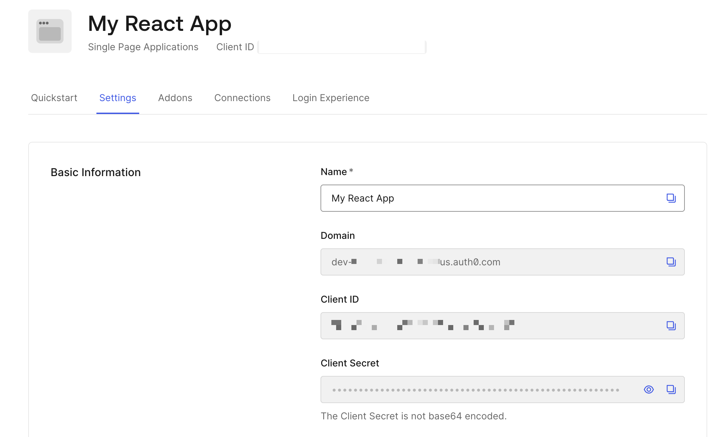
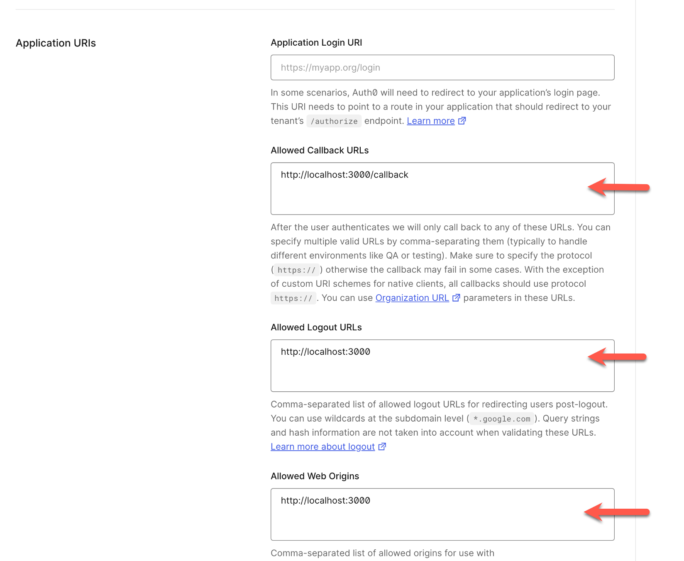
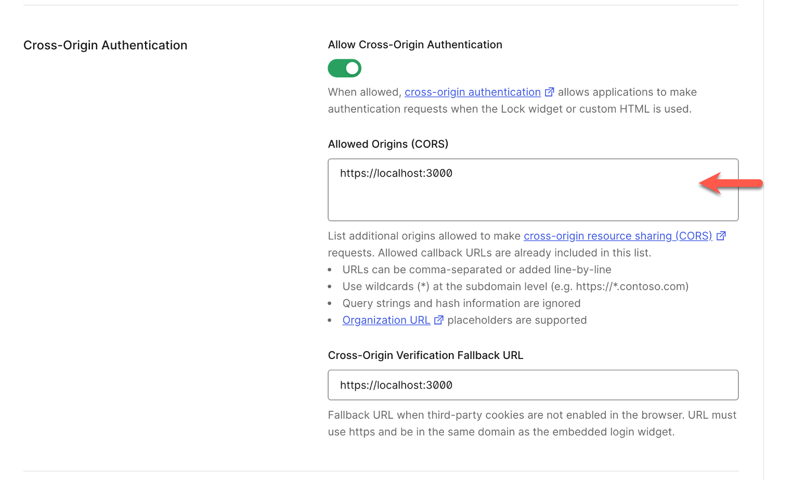
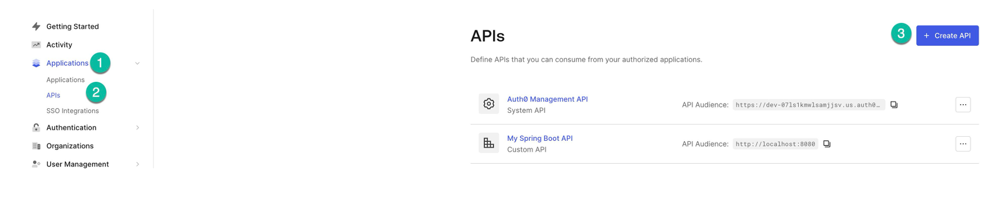
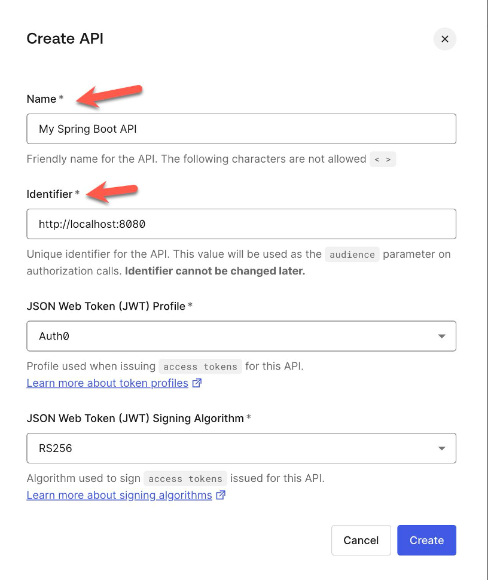
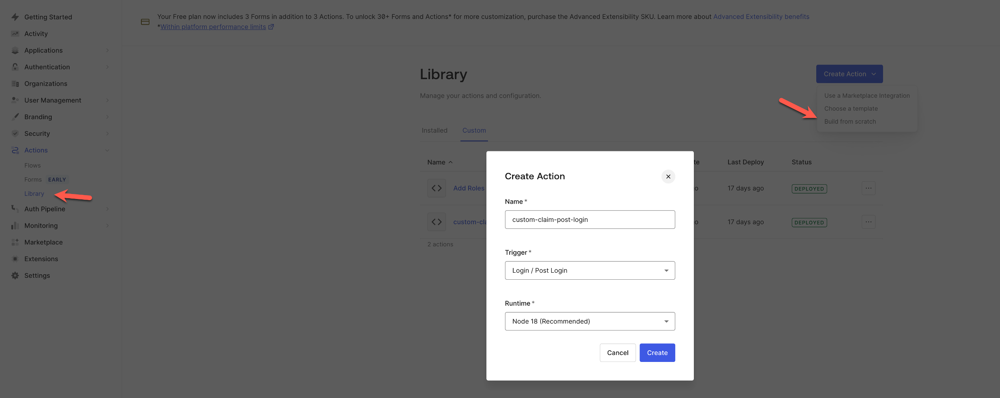
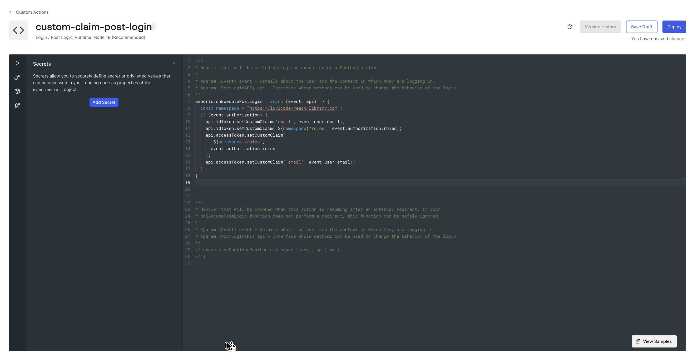
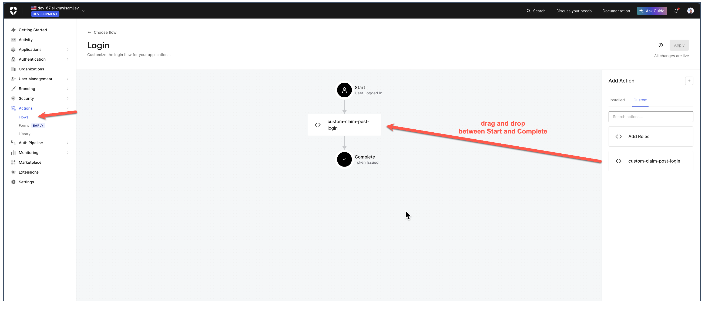
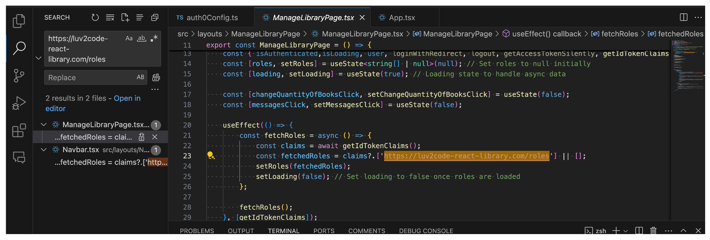
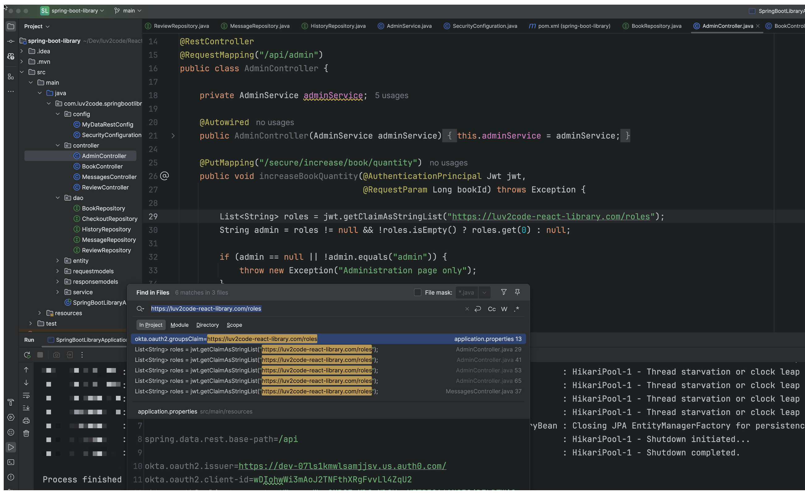

# Security Login/Logout - Auth0 Integration Tutorial

## Introduction

In this tutorial, you will learn how to integrate Auth0 into a react library application.
Users can Sign up or log in (including social login)

## Prerequisites
This tutorial assumes that you have already completed the section **“Library Project – Reviews On Book Checkout Page”** in *Build a Full Stack App - React and Java Spring Boot* course.

## Overview of Steps
1. Create a developer account on Auth0
1. Create Application and provide Application Information
1. Create API
1. Install Auth0 dependencies
1. Create/ Update `lib/auth0Config.ts`
1. Add Login Status Component
1. Update `App.tsx`
1. Add Logout Functionality
1. Homepage Refactor with Authentication
1. Checkout Book Functionality
1. Spring Boot – Backend Changes
1. Add an Admin Role
1. Run the Application

## 1. Create a Developer Account on Auth0

### SIGN UP
1. Open: [https://developer.auth0.com/](https://developer.auth0.com/)  
2. Sign up.

## 2. Create an Application on Auth0 and provide App information

### Create Application
1. In Auth0 Developer Account, select Applications > Applications > + Create Application ...
1. Give a name: My React App.
1. Choose *Single Page Web Applications*
1. Click: *Create*
1. Click: *Settings*

### Provide App Information
Add Application URIs
- **Allowed Callback URLs**: http://localhost:3000/login/callback
- **Allowed Logout URLs**: http://localhost:3000
- **Allowed Web Origins**: http://localhost:3000
- **Allowed Origins (CORS)**: http://localhost:3000







Click *Save*

---

## 3. Create API

### Create Application
1. In Auth0 Developer Account, select Applications > API > + Create API...
1. Give a name: My Spring Boot App
1. Identifier: << BACKEND API URI >> Ex: http://localhost:8080
1. Create





---

## 4. Install Auth0 Dependencies

**Run the following command** on vs code (React app) console
```
npm install @auth0/auth0-react 
```

## 5. Create/ Update `auth0Config.ts`

File : src/lib/auth0Config.ts

```
export const auth0Config = {
 clientId: '"<<UPDATE-WITH-YOUR-APP-CLIENT-ID>>"',
 issuer: "<<UPDATE-WITH-YOUR-DOMAIN>>",
 audience: "http://localhost:8080",
 redirectUri: window.location.origin+"/callback",
 scope: 'openid profile email'
}
```

Example (lib/auth0Config.ts): 

```
export const auth0Config = {
 clientId: 'abcdefgdE3mAoSMTNAbcdEFgvvLl4ZqU2',
 issuer: '1234567luv2code.us.auth0.com',
 audience: "http://localhost:8080",
 redirectUri: window.location.origin+"/callback",
 scope: 'openid profile email'
}
```

## 6. Add LoginPage.jsx
Create login page and add the code as shown below:

File : LoginPage.jsx

```
import React from 'react';
import { useAuth0 } from '@auth0/auth0-react';

const LoginPage = () => {
 const { loginWithRedirect } = useAuth0();

  return (
    <div>
      <button onClick={() => loginWithRedirect()}>Log In</button>
    </div>
  );

};

export default LoginPage;
```

## 7. Update `App.tsx `
Update src/App.tsx as below: 

```
import React from 'react';
import { Redirect, Route, Switch, useHistory } from 'react-router-dom';
import './App.css';
import { BookCheckoutPage } from './layouts/BookCheckoutPage/BookCheckoutPage';
import { HomePage } from './layouts/HomePage/HomePage';
import { Footer } from './layouts/NavbarAndFooter/Footer';
import { Navbar } from './layouts/NavbarAndFooter/Navbar';
import { SearchBooksPage } from './layouts/SearchBooksPage/SearchBooksPage';
import { ReviewListPage } from './layouts/BookCheckoutPage/ReviewListPage/ReviewListPage';
import { ShelfPage } from './layouts/ShelfPage/ShelfPage';
import { MessagesPage } from './layouts/MessagesPage/MessagesPage';
import { ManageLibraryPage } from './layouts/ManageLibraryPage/ManageLibraryPage';
import { Auth0Provider, withAuthenticationRequired } from '@auth0/auth0-react';

import { auth0Config } from './lib/auth0Config';
import LoginPage from './Auth/LoginPage';
import { Auth0Provider, withAuthenticationRequired} from '@auth0/auth0-react';

const Auth0ProviderWithHistory = ({ children }: { children: React.ReactNode }) => {
  const history = useHistory();

  const onRedirectCallback = (appState: any) => {
    history.push(appState?.returnTo || "/home");
  };

  return (
    <Auth0Provider
      domain={auth0Config.issuer}
      clientId={auth0Config.clientId}
      authorizationParams={{
        redirect_uri: auth0Config.redirectUri,
        audience: auth0Config.audience,
        scope: auth0Config.scope,
      }} 
       onRedirectCallback={onRedirectCallback}
    >
      {children}
    </Auth0Provider>
  );
};

const SecureRoute = ({ component, path, ...args }: { component: React.ComponentType<any>, path: string }) => (
  <Route path={path} component={withAuthenticationRequired(component)} {...args} />
);

export const App = () => {

  return (
    <div className='d-flex flex-column min-vh-100'>
      <Auth0ProviderWithHistory>
      <Navbar />
      <div className='flex-grow-1'>
        <Switch>
          <Route path='/' exact>
            <Redirect to='/home' />
          </Route>
          <Route path='/home'>
            <HomePage />
          </Route>
          <Route path='/search'>
            <SearchBooksPage />
          </Route>
          <Route path='/reviewlist/:bookId'>
            <ReviewListPage/>
          </Route>
          <Route path='/checkout/:bookId'>
            <BookCheckoutPage/>
          </Route>
          <Route path='/login' render={() => <LoginPage />} />
          <SecureRoute path='/shelf' component={ShelfPage} />
          <SecureRoute path='/messages' component={MessagesPage} />
          <SecureRoute path='/admin' component={ManageLibraryPage} />
        </Switch>
      </div>
      <Footer />
      </Auth0ProviderWithHistory>
    </div>
  );
}
```

## 8. Add Logout Functionality
Update src/layouts/NavbarAndFooter/Navbar.tsx as below:

File : Navbar.tsx

```
import { Link, NavLink } from "react-router-dom";

import { SpinnerLoading } from "../Utils/SpinnerLoading";
import { useAuth0 } from "@auth0/auth0-react";
import React, { useEffect, useState } from "react";

export const Navbar = () => {

    const [roles, setRoles] = useState<string[] | null>(null); 
    const [loading, setLoading] = useState(true); // Loading state to handle async data
    const { isAuthenticated, loginWithRedirect, logout, getIdTokenClaims } = useAuth0();

    useEffect(() => {
      const fetchRoles = async () => {
          const claims = await getIdTokenClaims();
          const fetchedRoles = claims?.['https://luv2code-react-library.com/roles'] || [];
          setRoles(fetchedRoles);
          setLoading(false); // Set loading to false once roles are loaded
      };

      fetchRoles();
  }, [isAuthenticated, getIdTokenClaims]);

  if (loading) {
    return <SpinnerLoading />
  }

  const handleLogout = () => {
    console.log("handleLogout");
    logout({ logoutParams: { returnTo: window.location.origin } })
  };

  const handleLogin =  () => {
     loginWithRedirect();
    window.location.assign("/");
  };

  console.log("isAuthenticated: ", isAuthenticated);

  return (
    <nav className='navbar navbar-expand-lg navbar-dark main-color py-3'>
      <div className='container-fluid'>
        <span className='navbar-brand'>Luv 2 Read</span>
        <button className='navbar-toggler' type='button'
          data-bs-toggle='collapse' data-bs-target='#navbarNavDropdown'
          aria-controls='navbarNavDropdown' aria-expanded='false'
          aria-label='Toggle Navigation'
        >
          <span className='navbar-toggler-icon'></span>
        </button>
        <div className='collapse navbar-collapse' id='navbarNavDropdown'>
          <ul className='navbar-nav'>
            <li className='nav-item'>
              <NavLink className='nav-link' to='/home'>Home</NavLink>
            </li>
            <li className='nav-item'>
              <NavLink className='nav-link' to='/search'>Search Books</NavLink>
            </li>
            {isAuthenticated &&
              <li className='nav-item'>
                <NavLink className='nav-link' to='/shelf'>Shelf</NavLink>
              </li>
            }
            
            {isAuthenticated && roles?.includes('admin') &&
              <li className='nav-item'>
                <NavLink className='nav-link' to='/admin'>Admin</NavLink>
              </li>
            }
          </ul>
          <ul className='navbar-nav ms-auto'>
            {!isAuthenticated ?
              <li className='nav-item m-1'>
                <button  className='btn btn-outline-light' onClick={handleLogin}>Sign in</button>
              </li>
              :
              <li>
                <button className='btn btn-outline-light' onClick={handleLogout}>Logout</button>
              </li>
            }
          </ul>
        </div>
      </div>
    </nav>
  );
}
```

## 9. Home Page Refactor with Authentication
Update src/layouts/HomePage/components/Heros.tsx as below:

File: Heroes.tsx

```
import { useAuth0 } from "@auth0/auth0-react";
import { Link } from "react-router-dom";

export const Heros = () => {

    
    const { isAuthenticated } = useAuth0();
    return (
        <div>
            <div className='d-none d-lg-block'>
                <div className='row g-0 mt-5'>
                    <div className='col-sm-6 col-md-6'>
                        <div className='col-image-left'></div>
                    </div>
                    <div className='col-4 col-md-4 container d-flex justify-content-center align-items-center'>
                        <div className='ml-2'>
                            <h1>What have you been reading?</h1>
                            <p className='lead'>
                                The library team would love to know what you have been reading.
                                Whether it is to learn a new skill or grow within one,
                                we will be able to provide the top content for you!
                            </p>
                            {isAuthenticated ? 
                                <Link type='button' className='btn main-color btn-lg text-white'
                                    to='search'>Explore top books </Link>
                                :
                                <Link className='btn main-color btn-lg text-white' to='/login'>Sign up</Link>
                            }  
                        </div>
                    </div>
                </div>
                <div className='row g-0'>
                    <div className='col-4 col-md-4 container d-flex 
                        justify-content-center align-items-center'>
                        <div className='ml-2'>
                            <h1>Our collection is always changing!</h1>
                            <p className='lead'>
                                Try to check in daily as our collection is always changing! 
                                We work nonstop to provide the most accurate book selection possible 
                                for our Luv 2 Read students! We are diligent about our book selection 
                                and our books are always going to be our 
                                top priority.
                            </p>
                        </div>
                    </div>
                    <div className='col-sm-6 col-md-6'>
                        <div className='col-image-right'></div>
                    </div>
                </div>
            </div>

            {/* Mobile Heros */}
            <div className='d-lg-none'>
                <div className='container'>
                    <div className='m-2'>
                        <div className='col-image-left'></div>
                        <div className='mt-2'>
                            <h1>What have you been reading?</h1>
                            <p className='lead'>
                                The library team would love to know what you have been reading.
                                Whether it is to learn a new skill or grow within one,
                                we will be able to provide the top content for you!
                            </p>
                            {isAuthenticated ? 
                                <Link type='button' className='btn main-color btn-lg text-white'
                                    to='search'>Explore top books</Link>
                                :
                                <Link className='btn main-color btn-lg text-white' to='/login'>Sign up</Link>
                        }
                        </div>
                    </div>
                    <div className='m-2'>
                        <div className='col-image-right'></div>
                        <div className='mt-2'>
                            <h1>Our collection is always changing!</h1>
                            <p className='lead'>
                                Try to check in daily as our collection is always changing! 
                                We work nonstop to provide the most accurate book selection possible 
                                for our Luv 2 Read students! We are diligent about our book selection 
                                and our books are always going to be our 
                                top priority.
                            </p>
                        </div>
                    </div>
                </div>
            </div>
        </div>
    );
}
```

## 10. Checkout Book Functionality
Update src/layouts/BookCheckoutPage/BookCheckoutPage.tsx as below:


File: BookCheckoutPage.tsx

```
import { useEffect, useState } from "react";
import BookModel from "../../models/BookModel";
import ReviewModel from "../../models/ReviewModel";
import { SpinnerLoading } from "../Utils/SpinnerLoading";
import { StarsReview } from "../Utils/StarsReview";
import { CheckoutAndReviewBox } from "./CheckoutAndReviewBox";
import { LatestReviews } from "./LatestReviews";

import ReviewRequestModel from "../../models/ReviewRequestModel";
import { useAuth0 } from "@auth0/auth0-react";

export const BookCheckoutPage = () => {


    const { isAuthenticated, getAccessTokenSilently } = useAuth0();

    const [book, setBook] = useState<BookModel>();
    const [isLoading, setIsLoading] = useState(true);
    const [httpError, setHttpError] = useState(null);

    // Review State
    const [reviews, setReviews] = useState<ReviewModel[]>([])
    const [totalStars, setTotalStars] = useState(0);
    const [isLoadingReview, setIsLoadingReview] = useState(true);

    const [isReviewLeft, setIsReviewLeft] = useState(false);
    const [isLoadingUserReview, setIsLoadingUserReview] = useState(true);

    // Loans Count State
    const [currentLoansCount, setCurrentLoansCount] = useState(0);
    const [isLoadingCurrentLoansCount, setIsLoadingCurrentLoansCount] = useState(true);

    // Is Book Check Out?
    const [isCheckedOut, setIsCheckedOut] = useState(false);
    const [isLoadingBookCheckedOut, setIsLoadingBookCheckedOut] = useState(true);

    const bookId = (window.location.pathname).split('/')[2];

    useEffect(() => {
        const fetchBook = async () => {
            const baseUrl: string = `http://localhost:8080/api/books/${bookId}`;

            const response = await fetch(baseUrl);

            if (!response.ok) {
                throw new Error('Something went wrong!');
            }

            const responseJson = await response.json();

            const loadedBook: BookModel = {
                id: responseJson.id,
                title: responseJson.title,
                author: responseJson.author,
                description: responseJson.description,
                copies: responseJson.copies,
                copiesAvailable: responseJson.copiesAvailable,
                category: responseJson.category,
                img: responseJson.img,
            };

            setBook(loadedBook);
            setIsLoading(false);
        };
        fetchBook().catch((error: any) => {
            setIsLoading(false);
            setHttpError(error.message);
        })
    }, [getAccessTokenSilently, isCheckedOut, bookId]);

    useEffect(() => {
        const fetchBookReviews = async () => {
            const reviewUrl: string = `http://localhost:8080/api/reviews/search/findByBookId?bookId=${bookId}`;

            const responseReviews = await fetch(reviewUrl);

            if (!responseReviews.ok) {
                throw new Error('Something went wrong!');
            }

            const responseJsonReviews = await responseReviews.json();

            const responseData = responseJsonReviews._embedded.reviews;

            const loadedReviews: ReviewModel[] = [];

            let weightedStarReviews: number = 0;

            for (const key in responseData) {
                loadedReviews.push({
                    id: responseData[key].id,
                    userEmail: responseData[key].userEmail,
                    date: responseData[key].date,
                    rating: responseData[key].rating,
                    book_id: responseData[key].bookId,
                    reviewDescription: responseData[key].reviewDescription,
                });
                weightedStarReviews = weightedStarReviews + responseData[key].rating;
            }

            if (loadedReviews) {
                const round = (Math.round((weightedStarReviews / loadedReviews.length) * 2) / 2).toFixed(1);
                setTotalStars(Number(round));
            }

            setReviews(loadedReviews);
            setIsLoadingReview(false);
        };

        fetchBookReviews().catch((error: any) => {
            setIsLoadingReview(false);
            setHttpError(error.message);
        })
    }, [isReviewLeft, bookId]);

    useEffect(() => {
        const fetchUserReviewBook = async () => {
            if (isAuthenticated) {
                const accessToken = await getAccessTokenSilently();
                const url = `http://localhost:8080/api/reviews/secure/user/book?bookId=${bookId}`;
                const requestOptions = {
                    method: 'GET',
                    headers: {
                        Authorization: `Bearer ${accessToken}`,
                        'Content-Type': 'application/json'
                    }
                };
                const userReview = await fetch(url, requestOptions);
                if (!userReview.ok) {
                    throw new Error('Something went wrong');
                }
                const userReviewResponseJson = await userReview.json();
                setIsReviewLeft(userReviewResponseJson);
            }
            setIsLoadingUserReview(false);
        }
        fetchUserReviewBook().catch((error: any) => {
            setIsLoadingUserReview(false);
            setHttpError(error.message);
        })
    }, [bookId, isAuthenticated, getAccessTokenSilently]);

    useEffect(() => {
        const fetchUserCurrentLoansCount = async () => {
            if (isAuthenticated) {
                const accessToken = await getAccessTokenSilently();
                const url = `http://localhost:8080/api/books/secure/currentloans/count`;
                const requestOptions = {
                    method: 'GET',
                    headers: { 
                        Authorization: `Bearer ${accessToken}`,
                        'Content-Type': 'application/json'
                     }
                };
                const currentLoansCountResponse = await fetch(url, requestOptions);
                if (!currentLoansCountResponse.ok)  {
                    throw new Error('Something went wrong!');
                }
                const currentLoansCountResponseJson = await currentLoansCountResponse.json();
                setCurrentLoansCount(currentLoansCountResponseJson);
            }
            setIsLoadingCurrentLoansCount(false);
        }
        fetchUserCurrentLoansCount().catch((error: any) => {
            setIsLoadingCurrentLoansCount(false);
            setHttpError(error.message);
        })
    }, [isAuthenticated, getAccessTokenSilently, isCheckedOut]);

    useEffect(() => {
        const fetchUserCheckedOutBook = async () => {
            if (isAuthenticated) {
                const accessToken = await getAccessTokenSilently();
                const url = `http://localhost:8080/api/books/secure/ischeckedout/byuser?bookId=${bookId}`;
                const requestOptions = {
                    method: 'GET',
                    headers: {
                        Authorization: `Bearer ${accessToken}`,
                        'Content-Type': 'application/json'
                    }
                };
                const bookCheckedOut = await fetch(url, requestOptions);

                if (!bookCheckedOut.ok) {
                    throw new Error('Something went wrong!');
                }

                const bookCheckedOutResponseJson = await bookCheckedOut.json();
                setIsCheckedOut(bookCheckedOutResponseJson);
            }
            setIsLoadingBookCheckedOut(false);
        }
        fetchUserCheckedOutBook().catch((error: any) => {
            setIsLoadingBookCheckedOut(false);
            setHttpError(error.message);
        })
    }, [bookId, isAuthenticated, getAccessTokenSilently]);

    if (isLoading || isLoadingReview || isLoadingCurrentLoansCount || isLoadingBookCheckedOut || isLoadingUserReview) {
        return (
            <SpinnerLoading />
        )
    }

    if (httpError) {
        return (
            <div className='container m-5'>
                <p>{httpError}</p>
            </div>
        )
    }

    async function checkoutBook() {
        const accessToken = await getAccessTokenSilently();
        const url = `http://localhost:8080/api/books/secure/checkout?bookId=${book?.id}`;
        const requestOptions = {
            method: 'PUT',
            headers: {
                Authorization: `Bearer ${accessToken}`,
                'Content-Type': 'application/json'
            }
        };
        const checkoutResponse = await fetch(url, requestOptions);
        if (!checkoutResponse.ok) {
            throw new Error('Something went wrong!');
        }
        setIsCheckedOut(true);
    }

    async function submitReview(starInput: number, reviewDescription: string) {
        let bookId: number = 0;
        if (book?.id) {
            bookId = book.id;
        }

        const reviewRequestModel = new ReviewRequestModel(starInput, bookId, reviewDescription);
        const url = `http://localhost:8080/api/reviews/secure`;
        const accessToken = await getAccessTokenSilently();
        const requestOptions = {
            method: 'POST',
            headers: {
                Authorization: `Bearer ${accessToken}`,
                'Content-Type': 'application/json'
            },
            body: JSON.stringify(reviewRequestModel)
        };
        const returnResponse = await fetch(url, requestOptions);
        if (!returnResponse.ok) {
            throw new Error('Something went wrong!');
        }
        setIsReviewLeft(true);
    }

    return (
        <div>
            <div className='container d-none d-lg-block'>
                <div className='row mt-5'>
                    <div className='col-sm-2 col-md-2'>
                        {book?.img ?
                            
                            :
                            
                        }
                    </div>
                    <div className='col-4 col-md-4 container'>
                        <div className='ml-2'>
                            <h2>{book?.title}</h2>
                            <h5 className='text-primary'>{book?.author}</h5>
                            <p className='lead'>{book?.description}</p>
                            <StarsReview rating={totalStars} size={32} />
                        </div>
                    </div>
                    <CheckoutAndReviewBox book={book} mobile={false} currentLoansCount={currentLoansCount} 
                        isAuthenticated={isAuthenticated} isCheckedOut={isCheckedOut} 
                        checkoutBook={checkoutBook} isReviewLeft={isReviewLeft} submitReview={submitReview}/>
                </div>
                <hr />
                <LatestReviews reviews={reviews} bookId={book?.id} mobile={false} />
            </div>
            <div className='container d-lg-none mt-5'>
                <div className='d-flex justify-content-center alighn-items-center'>
                    {book?.img ?
                        
                        :
                        
                    }
                </div>
                <div className='mt-4'>
                    <div className='ml-2'>
                        <h2>{book?.title}</h2>
                        <h5 className='text-primary'>{book?.author}</h5>
                        <p className='lead'>{book?.description}</p>
                        <StarsReview rating={totalStars} size={32} />
                    </div>
                </div>
                <CheckoutAndReviewBox book={book} mobile={true} currentLoansCount={currentLoansCount} 
                    isAuthenticated={isAuthenticated} isCheckedOut={isCheckedOut} 
                    checkoutBook={checkoutBook} isReviewLeft={isReviewLeft} submitReview={submitReview}/>
                <hr />
                <LatestReviews reviews={reviews} bookId={book?.id} mobile={true} />
            </div>
        </div>
    );
}

```


** Follow the same procedure and update authentication details for the below files: **
- src/layouts/HomePage/components/LibraryServices.tsx
- src/layouts/ManageLibraryPage/ManageLibraryPage.tsx
- src/layouts/ManageLibraryPage/components/AddNewBook.tsx
- src/layouts/ManageLibraryPage/components/AdminMessages.tsx
- src/layouts/ManageLibraryPage/components/ChangeQuantityOfBook.tsx
- src/layouts/MessagesPage/components/Messages.tsx
- src/layouts/MessagesPage/components/PostNewMessage.tsx
- src/layouts/ShelfPage/components/HistoryPage.tsx
- src/layouts/ShelfPage/components/Loans.tsx

Example for: src/layouts/ManageLibraryPage/ManageLibraryPage.tsx

```
import { useEffect, useState } from 'react';
import { Redirect } from 'react-router-dom';
import { AddNewBook } from './components/AddNewBook';
import { AdminMessages } from './components/AdminMessages';
import { ChangeQuantityOfBooks } from './components/ChangeQuantityOfBooks';
import { useAuth0 } from '@auth0/auth0-react';
import { SpinnerLoading } from '../Utils/SpinnerLoading';

export const ManageLibraryPage = () => {

const { getIdTokenClaims } = useAuth0();
    const [roles, setRoles] = useState<string[] | null>(null); // Set roles to null initially
    const [loading, setLoading] = useState(true); // Loading state to handle async data

    const [changeQuantityOfBooksClick, setChangeQuantityOfBooksClick] = useState(false);
    const [messagesClick, setMessagesClick] = useState(false);

    useEffect(() => {
        const fetchRoles = async () => {
            const claims = await getIdTokenClaims();
            const fetchedRoles = claims?.['https://luv2code-react-library.com/roles'] || [];
            setRoles(fetchedRoles);
            setLoading(false); // Set loading to false once roles are loaded
        };

        fetchRoles();
    }, [getIdTokenClaims]);
    

    function addBookClickFunction() {
        setChangeQuantityOfBooksClick(false);
        setMessagesClick(false);
    }

    function changeQuantityOfBooksClickFunction() {
        setChangeQuantityOfBooksClick(true);
        setMessagesClick(false);
    }

    function messagesClickFunction() {
        setChangeQuantityOfBooksClick(false);
        setMessagesClick(true);
    }

    // Handle loading state
    if (loading) {
        return (<SpinnerLoading />) 
    }

    if (!roles?.includes('admin')) {
        return <Redirect to='/home'/>
    }
    

    return (
        <div className='container'>
            <div className='mt-5'>
                <h3>Manage Library</h3>
                <nav>
                    <div className='nav nav-tabs' id='nav-tab' role='tablist'>
                        <button onClick={addBookClickFunction} className='nav-link active' id='nav-add-book-tab' data-bs-toggle='tab' 
                            data-bs-target='#nav-add-book' type='button' role='tab' aria-controls='nav-add-book' 
                            aria-selected='false'
                        >
                            Add new book
                        </button>
                        <button onClick={changeQuantityOfBooksClickFunction} className='nav-link' id='nav-quantity-tab' data-bs-toggle='tab' 
                            data-bs-target='#nav-quantity' type='button' role='tab' aria-controls='nav-quantity' 
                            aria-selected='true'
                        >
                            Change quantity
                        </button>
                        <button onClick={messagesClickFunction} className='nav-link' id='nav-messages-tab' data-bs-toggle='tab' 
                            data-bs-target='#nav-messages' type='button' role='tab' aria-controls='nav-messages' 
                            aria-selected='false'
                        >
                            Messages
                        </button>
                    </div>
                </nav>
                <div className='tab-content' id='nav-tabContent'> 
                    <div className='tab-pane fade show active' id='nav-add-book' role='tabpanel'
                        aria-labelledby='nav-add-book-tab'>
                            <AddNewBook/>
                    </div>
                    <div className='tab-pane fade' id='nav-quantity' role='tabpanel' aria-labelledby='nav-quantity-tab'>
                       {changeQuantityOfBooksClick ? <ChangeQuantityOfBooks/> : <></>}
                    </div>
                    <div className='tab-pane fade' id='nav-messages' role='tabpanel' aria-labelledby='nav-messages-tab'>
                        {messagesClick ? <AdminMessages/> : <></>}
                    </div>
                </div>
            </div>
        </div>
    );
}

function getIdTokenClaims() {
    throw new Error('Function not implemented.');
}
```

## 11. Spring Boot – Backend changes
Spring Boot 3 is required to support Auth0.

### 1. Update pom.xml with Spring Boot 3 dependencies:

File: pom.xml

```
<?xml version="1.0" encoding="UTF-8"?>
<project xmlns="http://maven.apache.org/POM/4.0.0" xmlns:xsi="http://www.w3.org/2001/XMLSchema-instance"
    xsi:schemaLocation="http://maven.apache.org/POM/4.0.0 https://maven.apache.org/xsd/maven-4.0.0.xsd">
    <modelVersion>4.0.0</modelVersion>
    <parent>
        <groupId>org.springframework.boot</groupId>
        <artifactId>spring-boot-starter-parent</artifactId>
        <version>3.2.0</version>
        <relativePath/> <!-- lookup parent from repository -->
    </parent>
    <groupId>com.luv2code</groupId>
    <artifactId>spring-boot-library</artifactId>
    <version>0.0.1-SNAPSHOT</version>
    <name>spring-boot-library</name>
    <description>Spring Boot Application for React</description>
    <properties>
        <java.version>17</java.version>
    </properties>
    <dependencies>

        <dependency>
            <groupId>com.okta.spring</groupId>
            <artifactId>okta-spring-boot-starter</artifactId>
            <version>3.0.6</version>
        </dependency>

        <dependency>
            <groupId>org.springframework.boot</groupId>
            <artifactId>spring-boot-starter-data-jpa</artifactId>
        </dependency>
        <dependency>
            <groupId>org.springframework.boot</groupId>
            <artifactId>spring-boot-starter-data-rest</artifactId>
        </dependency>

        <dependency>
            <groupId>com.mysql</groupId>
            <artifactId>mysql-connector-j</artifactId>
            <scope>runtime</scope>
        </dependency>
        <dependency>
            <groupId>org.projectlombok</groupId>
            <artifactId>lombok</artifactId>
            <optional>true</optional>
        </dependency>
        <dependency>
            <groupId>org.springframework.boot</groupId>
            <artifactId>spring-boot-starter-test</artifactId>
            <scope>test</scope>
        </dependency>
    </dependencies>

    <build>
        <plugins>
            <plugin>
                <groupId>org.springframework.boot</groupId>
                <artifactId>spring-boot-maven-plugin</artifactId>
                <configuration>
                    <excludes>
                        <exclude>
                            <groupId>org.projectlombok</groupId>
                            <artifactId>lombok</artifactId>
                        </exclude>
                    </excludes>
                </configuration>
            </plugin>
        </plugins>
    </build>

</project>
```


### 2. Update Application properties with auth0 properties

File: application.properties

```
## issuer url must ends with "/"
okta.oauth2.issuer=https://<< UPDATE-WITH-YOUR-DOMAIN-NAME >/
okta.oauth2.client-id=<< UPDATE-WITH-YOUR-APP-CLIENT-ID >>
okta.oauth2.groupsClaim=https://luv2code-react-library.com/roles
okta.oauth2.audience=http://localhost:8080
```

Example:
```
okta.oauth2.issuer=https://1234567luv2code.us.auth0.com/
okta.oauth2.client-id=abcdefgmAoSMTNAbcdEFgvvLl4ZqU2
okta.oauth2.groupsClaim=https://luv2code-react-library.com/roles
okta.oauth2.audience=http://localhost:8080
```

### 3. Replace javax packages with jakarta
Spring Boot 3 replaces javax package names with jakarta

Search whole project and:
- Replace: `import javax.persistence.*;`
- With: `import jakarta.persistence.*;`

Replace column name with entity property for JPQL

- Replace (in ReviewRepository.java)
`@Query("delete from Review where book\_id in :book\_id")`

- With
`@Query("delete from Review where bookId in :book\_id")`

Replace column name with entity property for JPQL
- Replace(in CheckoutRepository.java)
`@Query("delete from Checkout where book\_id in :book\_id")`
- With
`@Query("delete from Checkout where bookId in :book\_id")`


### 4. Update Security Configuration

File: SecurityConfiguration.java

```
package com.luv2code.springbootlibrary.config;

import com.okta.spring.boot.oauth.Okta;
import org.springframework.context.annotation.Bean;
import org.springframework.context.annotation.Configuration;
import org.springframework.security.config.annotation.web.builders.HttpSecurity;
import org.springframework.security.config.annotation.web.configurers.AbstractHttpConfigurer;
import org.springframework.security.web.SecurityFilterChain;
import org.springframework.web.accept.ContentNegotiationStrategy;
import org.springframework.web.accept.HeaderContentNegotiationStrategy;

import static org.springframework.security.config.Customizer.withDefaults;

@Configuration
public class SecurityConfiguration {

    @Bean
    public SecurityFilterChain filterChain(HttpSecurity http) throws Exception {

        // Protect endpoints at /api/<type>/secure
        http.authorizeHttpRequests(configurer ->
                configurer
                        .requestMatchers("/api/books/secure/**",
                                "/api/reviews/secure/**",
                                "/api/messages/secure/**",
                                "/api/admin/secure/**")
                        .authenticated().anyRequest().permitAll())
                .oauth2Login(withDefaults())
                .oauth2ResourceServer((oauth2) -> oauth2.jwt(withDefaults()))
                .cors(withDefaults());

//        Disable Cross Site Request Forgery
        http.csrf(AbstractHttpConfigurer::disable);
        // Add content negotiation strategy
        http.setSharedObject(ContentNegotiationStrategy.class,
                new HeaderContentNegotiationStrategy());

        // Force a non-empty response body for 401's to make the response friendly
        Okta.configureResourceServer401ResponseBody(http);

        return http.build();
    }

}
```

### 6. Add JWT changes for all the controllers


File: BookController.java

```
package com.luv2code.springbootlibrary.controller;

import com.luv2code.springbootlibrary.entity.Book;
import com.luv2code.springbootlibrary.responsemodels.ShelfCurrentLoansResponse;
import com.luv2code.springbootlibrary.service.BookService;

import org.springframework.beans.factory.annotation.Autowired;
import org.springframework.security.core.annotation.AuthenticationPrincipal;
import org.springframework.security.oauth2.jwt.Jwt;
import org.springframework.web.bind.annotation.*;

import java.util.List;

@CrossOrigin("http://localhost:3000")
@RestController
@RequestMapping("/api/books")
public class BookController {

    private BookService bookService;

    @Autowired
    public BookController(BookService bookService) {
        this.bookService = bookService;
    }

    @GetMapping("/secure/currentloans")
    public List<ShelfCurrentLoansResponse> currentLoans(@AuthenticationPrincipal Jwt jwt)
        throws Exception
    {
        String userEmail = jwt.getClaim("email");
        return bookService.currentLoans(userEmail);
    }

    @GetMapping("/secure/currentloans/count")
    public int currentLoansCount(@AuthenticationPrincipal Jwt jwt) {
        String userEmail = jwt.getClaim("email");
        return bookService.currentLoansCount(userEmail);
    }

    @GetMapping("/secure/ischeckedout/byuser")
    public Boolean checkoutBookByUser(@AuthenticationPrincipal Jwt jwt,
                                      @RequestParam Long bookId) {
        String userEmail = jwt.getClaim("email");
        return bookService.checkoutBookByUser(userEmail, bookId);
    }

    @PutMapping("/secure/checkout")
    public Book checkoutBook (@AuthenticationPrincipal Jwt jwt,
                              @RequestParam Long bookId) throws Exception {
        String userEmail = jwt.getClaim("email");
        return bookService.checkoutBook(userEmail, bookId);
    }

    @PutMapping("/secure/return")
    public void returnBook(@AuthenticationPrincipal Jwt jwt,
                           @RequestParam Long bookId) throws Exception {
        String userEmail = jwt.getClaim("email");
        bookService.returnBook(userEmail, bookId);
    }

    @PutMapping("/secure/renew/loan")
    public void renewLoan(@AuthenticationPrincipal Jwt jwt,
                          @RequestParam Long bookId) throws Exception {
        String userEmail = jwt.getClaim("email");
        bookService.renewLoan(userEmail, bookId);
    }

}
```


File: MessagesControler.java

```
package com.luv2code.springbootlibrary.controller;

import com.luv2code.springbootlibrary.entity.Message;
import com.luv2code.springbootlibrary.requestmodels.AdminQuestionRequest;
import com.luv2code.springbootlibrary.service.MessagesService;

import org.springframework.beans.factory.annotation.Autowired;
import org.springframework.security.core.annotation.AuthenticationPrincipal;
import org.springframework.security.oauth2.jwt.Jwt;
import org.springframework.web.bind.annotation.*;

import java.util.List;

@CrossOrigin("http://localhost:3000")
@RestController
@RequestMapping("/api/messages")
public class MessagesController {

    private MessagesService messagesService;

    @Autowired
    public MessagesController(MessagesService messagesService) {
        this.messagesService = messagesService;
    }

    @PostMapping("/secure/add/message")
    public void postMessage(@AuthenticationPrincipal Jwt jwt,
                            @RequestBody Message messageRequest) {
        String userEmail = jwt.getClaim("email");
        messagesService.postMessage(messageRequest, userEmail);
    }

    @PutMapping("/secure/admin/message")
    public void putMessage(@AuthenticationPrincipal Jwt jwt,
                           @RequestBody AdminQuestionRequest adminQuestionRequest) throws Exception {
        String userEmail = jwt.getClaim("email");
        List<String> roles = jwt.getClaimAsStringList("https://luv2code-react-library.com/roles");
        String admin = roles != null && !roles.isEmpty() ? roles.get(0) : null;
        if (admin == null || !admin.equals("admin")) {
            throw new Exception("Administration page only.");
        }
        messagesService.putMessage(adminQuestionRequest, userEmail);
    }

}
```

File: ReviewController.java

```
package com.luv2code.springbootlibrary.controller;

import com.luv2code.springbootlibrary.requestmodels.ReviewRequest;
import com.luv2code.springbootlibrary.service.ReviewService;

import org.springframework.security.core.annotation.AuthenticationPrincipal;
import org.springframework.security.oauth2.jwt.Jwt;
import org.springframework.web.bind.annotation.*;

@CrossOrigin("http://localhost:3000")
@RestController
@RequestMapping("/api/reviews")
public class ReviewController {

    private ReviewService reviewService;

    public ReviewController (ReviewService reviewService) {
        this.reviewService = reviewService;
    }

    @GetMapping("/secure/user/book")
    public Boolean reviewBookByUser(@AuthenticationPrincipal Jwt jwt,
                                    @RequestParam Long bookId) throws Exception {
        String userEmail = jwt.getClaim("email");

        if (userEmail == null) {
            throw new Exception("User email is missing");
        }
        return reviewService.userReviewListed(userEmail, bookId);
    }

    @PostMapping("/secure")
    public void postReview(@AuthenticationPrincipal Jwt jwt,
                           @RequestBody ReviewRequest reviewRequest) throws Exception {
        String userEmail = jwt.getClaim("email");
        if (userEmail == null) {
            throw new Exception("User email is missing");
        }
        reviewService.postReview(userEmail, reviewRequest);
    }
}
```

### 7. Admin user need special permission via roles
(Configuration required on auth0 developer account – see the next step) 


File: AdminController.java

```
package com.luv2code.springbootlibrary.controller;

import com.luv2code.springbootlibrary.requestmodels.AddBookRequest;
import com.luv2code.springbootlibrary.service.AdminService;

import org.springframework.beans.factory.annotation.Autowired;
import org.springframework.security.core.annotation.AuthenticationPrincipal;
import org.springframework.security.oauth2.jwt.Jwt;
import org.springframework.web.bind.annotation.*;

import java.util.List;

@CrossOrigin("http://localhost:3000")
@RestController
@RequestMapping("/api/admin")
public class AdminController {

    private AdminService adminService;

    @Autowired
    public AdminController(AdminService adminService) {
        this.adminService = adminService;
    }

    @PutMapping("/secure/increase/book/quantity")
    public void increaseBookQuantity(@AuthenticationPrincipal Jwt jwt,
                                     @RequestParam Long bookId) throws Exception {

        List<String> roles = jwt.getClaimAsStringList("https://luv2code-react-library.com/roles");
        String admin = roles != null && !roles.isEmpty() ? roles.get(0) : null;

        if (admin == null || !admin.equals("admin")) {
            throw new Exception("Administration page only");
        }
        adminService.increaseBookQuantity(bookId);
    }

    @PutMapping("/secure/decrease/book/quantity")
    public void decreaseBookQuantity(@AuthenticationPrincipal Jwt jwt,
                                     @RequestParam Long bookId) throws Exception {
        List<String> roles = jwt.getClaimAsStringList("https://luv2code-react-library.com/roles");
        String admin = roles != null && !roles.isEmpty() ? roles.get(0) : null;

        if (admin == null || !admin.equals("admin")) {
            throw new Exception("Administration page only");
        }
        adminService.decreaseBookQuantity(bookId);
    }

    @PostMapping("/secure/add/book")
    public void postBook(@AuthenticationPrincipal Jwt jwt,
                         @RequestBody AddBookRequest addBookRequest) throws Exception {
        List<String> roles = jwt.getClaimAsStringList("https://luv2code-react-library.com/roles");
        String admin = roles != null && !roles.isEmpty() ? roles.get(0) : null;

        if (admin == null || !admin.equals("admin")) {
            throw new Exception("Administration page only");
        }
        adminService.postBook(addBookRequest);
    }

    @DeleteMapping("/secure/delete/book")
    public void deleteBook(@AuthenticationPrincipal Jwt jwt,
                           @RequestParam Long bookId) throws Exception {
        List<String> roles = jwt.getClaimAsStringList("https://luv2code-react-library.com/roles");
        String admin = roles != null && !roles.isEmpty() ? roles.get(0) : null;

        if (admin == null || !admin.equals("admin")) {
            throw new Exception("Administration page only");
        }
        adminService.deleteBook(bookId);
    }

}

```

### 12. Add an Admin role

#### Add Custom claim post login

* Select: Actions -> Library -> Create Action -> Build from scratch

* Name: custom-claim-post-login




* Click on Deploy

Add the following code:

```
exports.onExecutePostLogin = async (event, api) => {
  const namespace = "https://luv2code-react-library.com";
  if (event.authorization) {
    api.idToken.setCustomClaim('email', event.user.email);
    api.idToken.setCustomClaim(`${namespace}/roles`, event.authorization.roles);
    api.accessToken.setCustomClaim(
      `${namespace}/roles`,
      event.authorization.roles
    );
    api.accessToken.setCustomClaim('email', event.user.email);
  }
};
```






Note: namespace can be anything; But, use the same name to fetch roles in frontend and backend

* Frontend:



* Backend:



## 13. Run the Application

1. Login
2. Sign Up using Email address or use Social Login
3. Verify Member and Orders
4. Logout


